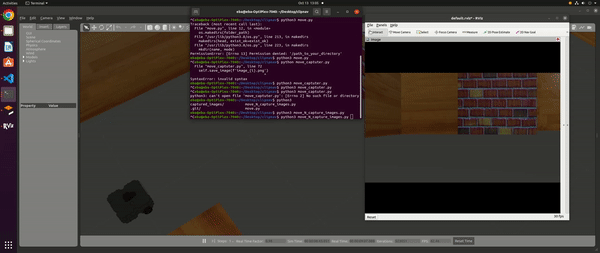

# Turtlebot Image Capture and Orientation Adjuster

We can capture images using a Turtlebot in the Gazebo simulation environment while rotating it across a circle. (I will be working on the real robot soon).




## Getting Started

Follow the instructions below to run the Turtlebot image capturing and orientation adjusting script.

### Prerequisites

1. Ensure you have ROS (Robot Operating System) installed.
2. You should have the Turtlebot3 Gazebo package installed.

### Launching the Gazebo Simulation

Start by launching the Turtlebot in the Gazebo environment with the following command:

```bash
roslaunch turtlebot3_gazebo turtlebot3_house.launch
```

### Running the Script

Navigate to the directory containing the `move_N_capture.py` script. Grant the script execute permissions and run it:

```bash
chmod +x move_N_capture.py
python3 move_N_capture_images.py
```


### Functionality

- **Image Capture Mode**: When run, the Turtlebot will capture images while rotating across a circle. It saves these images to the `./captured_images` directory and also records the orientation of the robot for each image in a corresponding `.txt` file.
  
- **Orientation Adjust Mode**: The script can adjust the Turtlebot to match a saved orientation. The saved orientations are stored in `.txt` files within the `./captured_images` directory.


